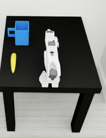
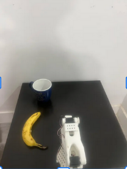
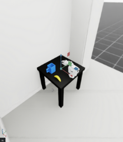
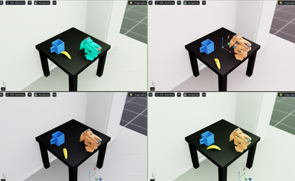
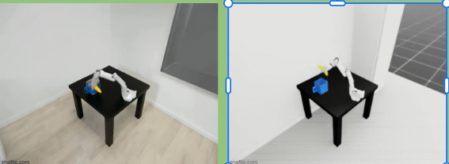
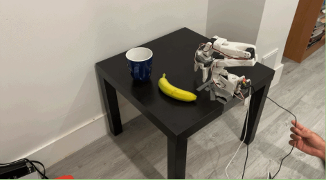

# Sim2Real Manipulation Data Pipeline

This project builds an end-to-end sim-to-real data pipeline for a tabletop manipulation task. I recreated a measured real-world workspace in Isaac Sim, imported the robot from URDF to USD, tuned collision geometry, collected teleoperated demonstrations in simulation and the real world, generated photorealistic sim data with Cosmos Transfer 2.5, and fine-tuned GR00T N1.6 for manipulation.




## Overview

The goal was to make a small real robot manipulation setup easier to transfer from simulation to hardware. Instead of trying to model every detail perfectly, the real workspace was made intentionally simple and repeatable, then the simulation was matched to it and randomized around the measured setup.

The pipeline covers:

- 1:1 room and tabletop reconstruction in Isaac Sim / Isaac Lab
- URDF to USD robot asset conversion
- collision tuning with convex decomposition and convex hull approximations
- calibrated environment and gripper camera views
- real leader arm to simulated follower arm teleoperation
- fixed-environment, randomized-sim, and real-world demonstration collection
- Cosmos Transfer 2.5 sim-to-photoreal data generation
- GR00T N1.6 fine-tuning through a remote GR00T training server

## Results

```text
30 fixed-environment simulated demonstrations
10 domain-randomized simulated demonstrations
5 real-world demonstrations
45 total demonstrations
Cosmos Transfer 2.5 photorealism pass
GR00T N1.6 fine-tuning
Remote GR00T server hosted on Brev / cloud GPU infrastructure
```

## Visual Pipeline

### Measured Sim Environment

The real room and manipulation station were measured and rebuilt in simulation so camera viewpoint, object placement, robot reachability, and scene scale matched the real setup.


### Real Workspace

The real setup was kept simple: fixed workspace, fixed robot base, fixed camera placement, and consistent object layout. This made the sim-to-real problem more controlled and gave the policy a clearer transfer target.


### Cameras

The dataset uses an environment camera and a gripper camera. Matching these camera streams across sim and real reduced the amount of conversion needed when merging demonstrations.



### Domain Randomization

The simulation was randomized across visual and physical properties so the model saw more variation before real-world deployment.

Randomized properties included:

- lighting intensity and color
- table, wall, floor, cup, and robot materials
- object pose
- joint initialization noise
- mass and friction ranges



### Sim-To-Photoreal Transfer

Some simulation episodes were processed with Cosmos Transfer 2.5 to reduce the visual gap between clean synthetic renders and real camera images while preserving the scene structure and motion.



### Real Inference

After merging sim, randomized sim, photoreal sim, and real demonstrations, the resulting dataset was used to fine-tune GR00T N1.6 for the manipulation task.



## System Design

```text
Real workspace measurements
        |
        v
Isaac Sim / Isaac Lab scene reconstruction
        |
        v
URDF -> USD robot import + collision tuning
        |
        v
Leader arm -> simulated follower teleoperation
        |
        v
Sim demonstration collection
        |
        +--> fixed environment demos
        +--> domain-randomized demos
        |
        v
Cosmos Transfer 2.5 photorealism pass
        |
        v
Real-world demonstration collection
        |
        v
Merged LeRobot-style dataset
        |
        v
GR00T N1.6 fine-tuning and inference
```

## Key Implementation Details

### Asset Import

The robot was imported from URDF into USD for use in Isaac Sim. After import, collision geometry was simplified for stable physics:

- convex decomposition for the gripper where contact fidelity mattered most
- convex hull approximations for simpler robot and environment assets
- measured scene primitives for walls, table, cup placement, and camera references

### Teleoperation

Leader-follower teleoperation maps real leader-arm motor states into the simulated follower arm. The same joint order and control conventions were kept across sim and real data collection so demonstrations could share a common schema.

### Data Collection

Demonstrations were collected in three stages:

1. Fixed sim environment for a clean baseline distribution
2. Domain-randomized sim environment for robustness
3. Real-world demonstrations to anchor the model to real sensor and robot behavior

### Fine-Tuning

The final training workflow fine-tuned GR00T N1.6 using the merged dataset. A GR00T server hosted on Brev / cloud GPU infrastructure supported remote training and inference workflows.

## Repository Layout

```text
.
├── 02_Sim2Real/
│   ├── Photos/                         # README images and visual results
│   ├── runCommand.md                   # useful launch commands
│   ├── slides.md                       # presentation notes
│   └── marker_pick_place/
│       ├── marker_pick_place.py        # Isaac Sim task entry point
│       ├── marker_pick_place/          # task, assets, MDP, teleop modules
│       └── tools/                      # dataset/camera utility scripts
├── cosmos/                             # Cosmos Transfer outputs
├── models/                             # GR00T fine-tuning checkpoints
├── merge_banana_datasets.py            # dataset merge utility
└── README.md
```

## Running The Sim

Run the marker pick-place environment:

```bash
PYTHONPATH=$PWD/02_Sim2Real/marker_pick_place \
/home/hassaan/robotics/IsaacLab/isaaclab.sh -p 02_Sim2Real/marker_pick_place/marker_pick_place.py
```

Run teleoperation:

```bash
PYTHONPATH=$PWD/02_Sim2Real/marker_pick_place \
/home/hassaan/robotics/IsaacLab/isaaclab.sh -p 02_Sim2Real/marker_pick_place/marker_pick_place.py --teleop
```

Run teleoperation with camera recording:

```bash
PYTHONPATH=$PWD/02_Sim2Real/marker_pick_place \
/home/hassaan/robotics/IsaacLab/isaaclab.sh -p 02_Sim2Real/marker_pick_place/marker_pick_place.py --teleop --record
```

Recording hotkeys:

```text
R - start recording
Y - stop and save recording
T - reset environment and randomize domain
```

## Technologies

```text
Isaac Sim
Isaac Lab
URDF
USD
LeRobot
SO-100 / SO-101 style leader-follower teleoperation
collision geometry tuning
convex decomposition
convex hull collision meshes
domain randomization
Cosmos Transfer 2.5
GR00T N1.6
Brev / cloud GPU training
```

## What I Learned

- Matching scene scale and camera geometry matters as much as visual realism for sim-to-real transfer.
- Stable collision geometry is critical; visual meshes are usually too detailed for reliable physics.
- A fixed sim dataset gives a clean baseline, while randomized episodes improve robustness.
- A small amount of real data is still valuable because it anchors the model to real camera noise, lighting, and hardware behavior.
- Photorealistic transfer helps reduce the visual gap before the policy sees real deployment images.

